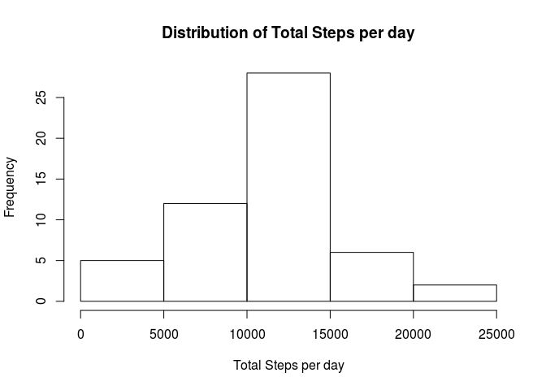
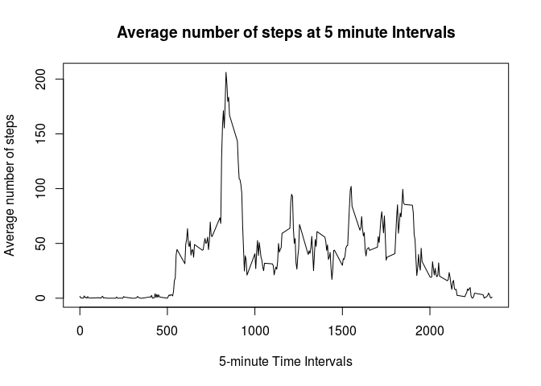
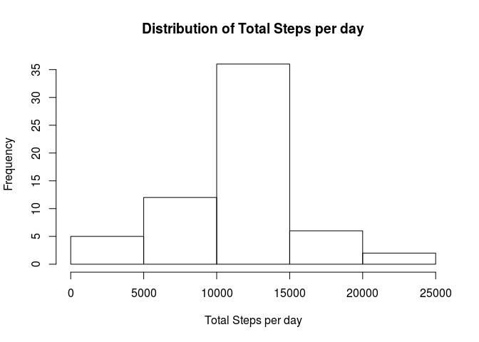
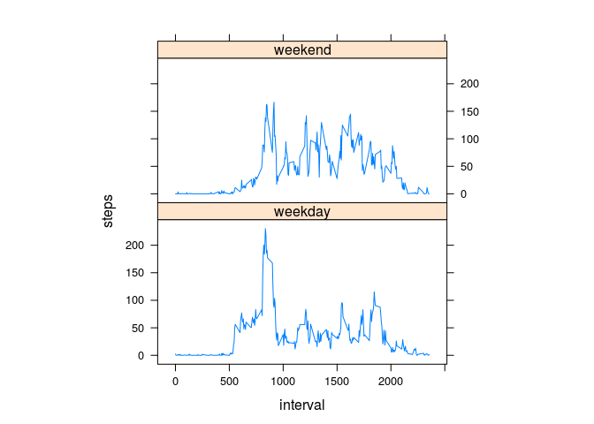

# Reproducible Research: Peer Assessment 1

## Loading and preprocessing the data
Move into working directory and download dataset (Note I did this before noticing that the dataset is available in the forked repo):

```r
setwd("~/Z-R/RepData")
if(!file.exists('activity.zip')){
  url<-"https://d396qusza40orc.cloudfront.net/repdata%2Fdata%2Factivity.zip"
  download.file(url,destfile = "activity.zip")
}
```

Uncompress file if necessary and read data:

```r
if (!file.exists("activity.csv")) { unzip("activity.zip") }
a_data <- read.table("activity.csv", sep=",", header=T)
```

## What is mean total number of steps taken per day?
1. Calculate the total number of steps taken per day:

```r
nsteps <- aggregate(steps ~ date, data = a_data, sum, na.rm = TRUE)
```
2. If you do not understand the difference between a histogram and a barplot, research the difference between them. Make a histogram of the total number of steps taken each day:

```r
hist(nsteps$steps,main="Distribution of Total Steps per day",
     xlab="Total Steps per day")
```

<!-- -->

3. Calculate and report the mean and median of the total number of steps taken per day:

```r
mu_steps <- mean(nsteps$steps)
med_steps <- median(nsteps$steps)
mu_steps
```

```
## [1] 10766.19
```

```r
med_steps
```

```
## [1] 10765
```

The mean is 10766, the median is 10765.

## What is the average daily activity pattern?
1. Make a time series plot (i.e. type = "l") of the 5-minute interval (x-axis) and the average number of steps taken, averaged across all days (y-axis):

```r
steps2 <- aggregate(steps ~ interval, data = a_data, mean, 
                            na.rm = TRUE)
plot(steps ~ interval, data = steps2, type = "l", 
     main = "Average number of steps at 5 minute Intervals",
     xlab = "5-minute Time Intervals", 
     ylab = "Average number of steps")
```

<!-- -->

2. Which 5-minute interval, on average across all the days in the dataset, contains the maximum number of steps?

```r
max <- steps2[which.max(steps2$steps),]
max
```

```
##     interval    steps
## 104      835 206.1698
```

Interval 835, with 206.17 steps.

## Imputing missing values
Note that there are a number of days/intervals where there are missing values (coded as NA). The presence of missing days may introduce bias into some calculations or summaries of the data.

1. Calculate and report the total number of missing values in the dataset (i.e. the total number of rows with NAs)

```r
nmiss <- sum(!complete.cases(a_data))
nmiss
```

```
## [1] 2304
```
2. Devise a strategy for filling in all of the missing values in the dataset.The strategy does not need to be sophisticated. For example, you could use the mean/median for that day, or the mean for that 5-minute interval,etc.

See next step. We will copy a_data to b_data, loop through b_data and impute mean value to any missing values.

3. Create a new dataset that is equal to the original dataset but with the missing data filled in.

```r
b_data <- a_data
for (i in 1:nrow(b_data)) {
  if (is.na(b_data$steps[i])) {
    idx <- b_data$interval[i]
    x <- steps2[steps2$interval==idx,"steps"]
    b_data$steps[i] <- x
  }
}
```
4. Make a histogram of the total number of steps taken each day and calculate and report the mean and median total number of steps taken per day. Do these values differ from the estimates from the first part of the assignment? What is the impact of imputing missing data on the estimates of the total daily number of steps?

After performing the steps below, we see that the mean & median hardly change at all after imputing the number of steps. The distribution however becomes a little "tighter", with a smaller standard deviation and the quantiles have changed a bit.


```r
nsteps_b <- aggregate(steps ~ date, data = b_data, sum)
hist(nsteps_b$steps,main="Distribution of Total Steps per day",
     xlab="Total Steps per day")
```

<!-- -->

```r
mu_steps_b <- mean(nsteps_b$steps)
med_steps_b <- median(nsteps_b$steps)
mu_steps
```

```
## [1] 10766.19
```

```r
mu_steps_b
```

```
## [1] 10766.19
```

```r
med_steps
```

```
## [1] 10765
```

```r
med_steps_b
```

```
## [1] 10766.19
```

```r
summary(nsteps$steps)
```

```
##    Min. 1st Qu.  Median    Mean 3rd Qu.    Max. 
##      41    8841   10760   10770   13290   21190
```

```r
sd(nsteps$steps)
```

```
## [1] 4269.18
```

```r
summary(nsteps_b$steps)
```

```
##    Min. 1st Qu.  Median    Mean 3rd Qu.    Max. 
##      41    9819   10770   10770   12810   21190
```

```r
sd(nsteps_b$steps)
```

```
## [1] 3974.391
```

## Are there differences in activity patterns between weekdays and weekends?
For this part the weekdays() function may be of some help here. Use the dataset with the filled-in missing values for this part.

1. Create a new factor variable in the dataset with two levels – “weekday” and “weekend” indicating whether a given date is a weekday or weekend day.

```r
b_data$daytype <- as.factor(ifelse(weekdays(as.Date(b_data$date)) %in% 
                                  c("Saturday","Sunday"),"weekend", "weekday"))
```
2. Make a panel plot containing a time series plot (i.e. type = "l") of the 5-minute interval (x-axis) and the average number of steps taken, averaged across all weekday days or weekend days (y-axis). See the README file in the GitHub repository to see an example of what this plot should look like using simulated data.

```r
library("lattice")
j <- aggregate(steps ~ interval + daytype, b_data, mean)

myplot <- xyplot(steps ~ interval | factor(daytype), data = j, aspect = 0.5, 
             type = "l")
print(myplot)
```

<!-- -->

In general, we see more activity on the weekends.
